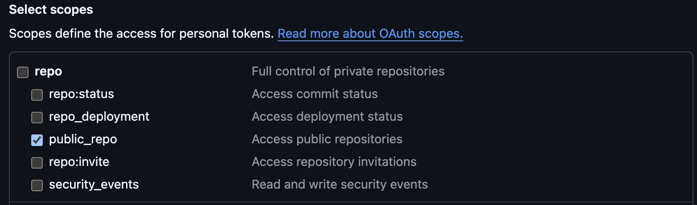

# reputation-ranking-system

The "Reputation Ranking System" is project that aims to build a semi-automatic way of assigning a retribuition score for a given open source project.

Find more about the ideas behind and the roadmap here: [https://club.dacoder.it/rrs](https://club.dacoder.it/rrs).

Inspired by [https://sourcecred.io/](https://sourcecred.io/).

## RRS: RRA + Spotlight

Composed of two subsystems: Reputation Ranking Algorithm (RRA) and Reputation Spotlight.

### RRA

Automatic algorithm that assigns a score for an open source project using Github API to gather the needed data.

### Spotlight

Manual updates of the reputation score in order to adjust for not traceable contributions (e.g. youtube comments or advice given via private emails/messages).

## Setup

If you want to try it with your system you will need only:

- Node.js
- Github account

### Github Token

After cloning locally the repository you will need a github token for fetching public data of a repository.
Learn how to obtain one.

When creating the token you will only need to select the scopes _repo > public_repo_.



When you have obtained the token, create an .env file with the following content:

```bash
# .env
GITHUB_TOKEN=your-token-here
```

### Run locally

- `yarn` or `npm i` to install dependencies (original setup with yarn, so there will be a yarn.lock, it is fine to have a package-lock.json if you use npm)
- add two lines to the `.env` files by specifying:

  ```bash
  # .env
  # ... other variables before
  GITHUB_OWNER=github-account
  GITHUB_REPO=github-repo-name
  ```

- `yarn dev`: will run the algorithm against the specificed repo

The results will be saved in the `output` folder in 3 different formats:

- `CONTRIBUTORS_SCOREBOARD.md`
- `scoreboard.html`
- `scoreboard.json`

## Feedbacks and contributions

If you have some feedback and want to contribute you can do it directly here in this repository!
You can open a bug, add more documentation, propose or develop a feature straight forward.
